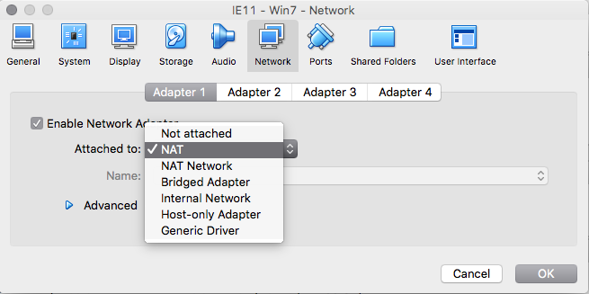

# Accessing containers from other Virtual Machines

If you use virtual machines to perform cross browser testing you'll need to know
how to configure VirtualBox networking to allow for communication with your
containers.

## Networking Mode

In your virtual machine settings, under **Network** choose an enabled adapter
and then choose NAT for the **Attached to** option.

This will ensure that processes from within virtual machine can route requests
through the network to your containers.

## DNS

In addition to the network setup, you'll need to choose one of the following
options so that the DNS entries for your containers can resolve to the proper IP
address.

### Hosts File

The first option is to manually manage the mapping of container domain names to
the appropriate IP address. To do this, any time you start or stop containers
you will need to take the output of `rig dns-records` and update the
[hosts file](https://en.wikipedia.org/wiki/Hosts_(file)) in the virtual machine.

### DNSDock

The second option is to set 172.17.0.1 as a DNS server in the virtual machine.

For Windows, you can use [these instructions for using Google's Public DNS](https://developers.google.com/speed/public-dns/docs/using)
to navigate to the correct area for setting your DNS server. Use 172.17.0.1
instead of the Google IP addresses.

For Linux systems, refer to the **Linux DNS configuration options** section of
the [Linux Installation instructions](../getting-started/linux-installation.md)
and choose the option that best works for your system.
