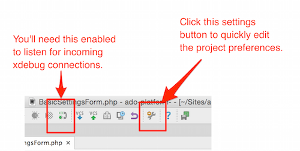
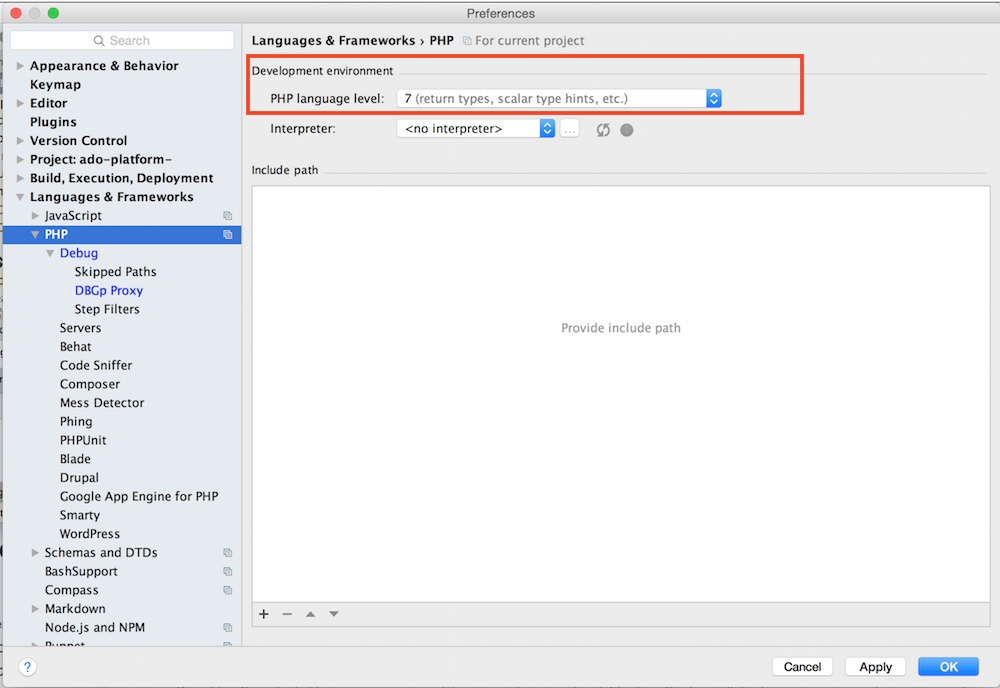
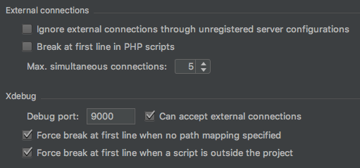
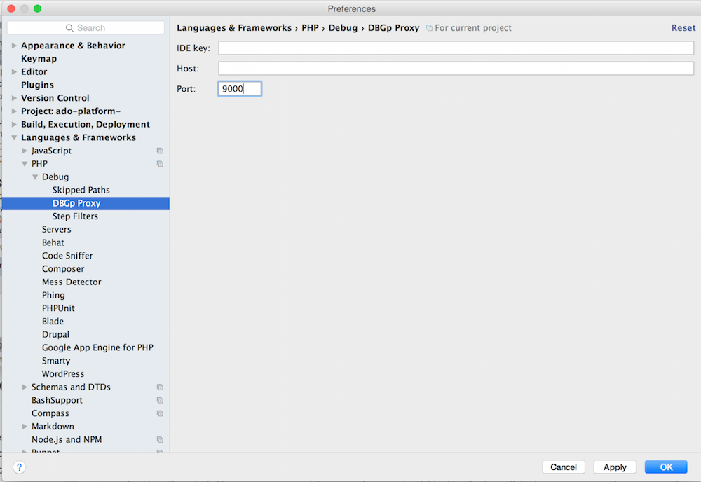
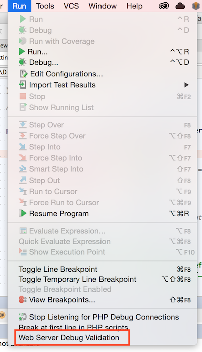
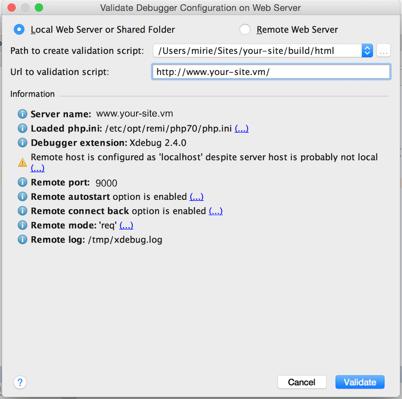
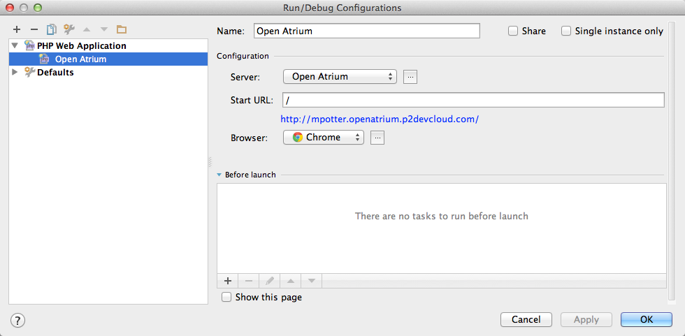

# Local Xdebug with Outrigger & PhpStorm

Getting [Xdebug](https://xdebug.org/) set up can be a bit challenging but while there are many discrete steps, they are 
individually straightforward. This guide will walk you through getting setup quickly with PhpStorm.

!!! note "Applies to use of the Phase2 Docker Images"
    This documentation specifically pertains to using Phase2's 
    [Apache-PHP Docker Images](https://hub.docker.com/r/phase2/apache-php-base/) 
    or the Phase2 [Build Image](https://hub.docker.com/r/phase2/build/).

    `rig` itself is only relevant in that it brokers standardized DNS practices.

!!! important "Make sure your environment is up-to-date"
    In case there might be fixes for any problems you might encounter, consider [updating rig](upgrading-rig.md) before 
    proceeding.

    Once done, run `rig doctor` to confirm Outrigger is in a healthy. Check out [Troubleshooting](../faq/troubleshooting.md) 
    or the [F.A.Q.](../faq/general.md) if anything comes up.

    If you haven't updated your Docker Images in awhile, doing so now is a good precautionary step that you have everything 
    you need. Check out the [Routine Image Maintenance](../common-tasks/routine-image-maintenance.md)

## Setup Steps

### 1. Activate Xdebug for your running Drupal site

In your docker command or your docker-compose.yml manifest, ensure the environment variable `PHP_XDEBUG="true"`. This 
will load the PHP Xdebug extension with the default configuration.

For details of the Xdebug configuration of Phase2's Apache PHP containers, check out the 
[apache-php-base Docker Hub page](https://hub.docker.com/r/phase2/apache-php-base/).

### 2. Configure PhpStorm for Xdebug

To get started configuring your PhpStorm IDE open the application settings.

Click on the wrench icon in the toolbar:



You can also get to the project settings by going to: PhpStorm > Preferences (OS X) or File > Settings (Windows, Linux).

### 3. Adjust the PHP Project settings

Make sure you have the correct version of PHP selected:



### 4. Adjust the Debug Project settings

- Xdebug is using Port 9000.
- Accept external connections.



!!! note "Eyes on Your Xdebug Configuration"
    You can view your Xdebug configuration by looking inside the Apache container.
    With the container name (found via `docker ps`), try running:

    ```
    docker exec [container_name] /usr/bin/env cat /etc/opt/remi/php70/php.d/15-xdebug.ini
    ```

    if using docker-compose with your Apache container named **www*, you can more simply run:

    ```
    docker-compose exec www /usr/bin/env cat /etc/opt/remi/php70/php.d/15-xdebug.ini
    ```

    This path varies by PHP version. For PHP 5.6 check `/etc/opt/rh/rh-php56/php.d/15-xdebug.ini`.

### 5. For the DBGp Proxy, just ensure that the port is the same

You can leave the other settings blank.



### 6. Adjust the Server Project settings

Create a new Server by clicking on the "+" button. Give your server a name and input the host.

Be sure to add the docroot mappings. The example shown here is using the 
[Grunt Drupal Tasks](https://github.com/phase2/grunt-drupal-tasks) project structure. There are two mappings in this 
case. One for the docroot (`build/html`) and the other for the `src` directory so that breakpoints can be set in the 
custom modules in the `src` directory as well.

These mappings are used to match paths from inside the Docker container to the paths
used in the local filesystem where PhpStorm is run.


### 7. Validate your debug settings

!!! important "Proxies Interfere with Xdebug"
    When setting your server URL, be sure to use the URL associated with your web container. If you are using a proxy 
    (such as Varnish) that URL may validate but will not work in practice.

Select the "Web Server Debug Validation" option from the "Run" menu option. (Confirm your Apache container is running 
or this validation will fail.)



This will display a dialog window that allows you to validate your settings. Make sure that your "Path to create 
validation script" points to your project docroot and the URL is your project URL.

If all goes well, clicking the "Validate" button should give you something like this:



Click the dialog 'x' (close) button to close this dialog window.

### 8. Restart PhpStorm

In order to ensure that all your settings are applying, you will need to restart PhpStorm.

### 9. Make sure that you listen for connections


### 10. Configure a Debugger

* Select Run -> Edit Configurations from the main PhpStorm menu
* Click + and add a "PHP Web Application"
* Give it a name, then select the Server defined in the previous section from the drop-down menu.
* Enter a Start URL of `/`.
* Select your Browser (e.g. Chrome)
* Click **OK**.



## Overriding the Default Xdebug Configuration

If your project or workflow has special needs, you can override the Xdebug configuration
using Volume Mounts to substitute your own template file. Copy 
[the original template](https://bitbucket.org/phase2tech/docker-apache-php-base/src/master/root/etc/confd/templates/xdebug.ini.tmpl?at=master&fileviewer=file-view-default) 
into your project and make the necessary changes. (You can also pull your current version of this file from the locally 
running docker image.)

Commit your version of the file and add a volume mount to your docker-compose manifest with an entry such as:

`./env/local/xdebug.ini.tmpl:/etc/confd/templates/xdebug.ini.tmpl`

Once that's in place, you will have to restart the container to pick up the new volume mount:

```bash
docker-compose restart www
```
