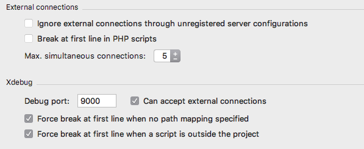

# Local Xdebug with Outrigger & PhpStorm

Getting [Xdebug](https://xdebug.org/) set up can be a bit challenging but while there are many discrete steps, they are 
individually straightforward. This guide will walk you through getting setup quickly with PhpStorm.

!!! note "Applies to use of the Outrigger Docker Images"
    This documentation specifically pertains to using the 
    [Apache-PHP Docker Image](https://hub.docker.com/r/outrigger/apache-php/) 
    or the [Build Image](https://hub.docker.com/r/outrigger/build/).

    `rig` itself is only relevant in that it brokers standardized DNS practices.

!!! important "Make sure your environment is up-to-date"
    In case there might be fixes for any problems you might encounter, consider [updating rig](upgrading-rig.md) before 
    proceeding.

    Once done, run `rig doctor` to confirm Outrigger is healthy. Check out [Troubleshooting](../faq/troubleshooting.md) 
    or the [F.A.Q.](../faq/general.md) if anything comes up.

    If you haven't updated your Docker Images in awhile, doing so now is a good precautionary step that you have everything 
    you need. Check out the [Routine Image Maintenance](../common-tasks/routine-image-maintenance.md)

## Conceptual Requirements

This section details the end configuration needs for Xdebug and connection between the containers
and your IDE.

For both browser and command line debugging PHPStorm needs to be configured to listen for the
Xdebug connection and map paths of files as they appear in the container to how they appear
to your IDE.

If you are familiar with normal Xdebug setup, there are common steps which may be omitted.
Specifically, there is no need to trigger the start of the debugger through query parameters,
POST parameters, cookies or environmental variables. Containers are set to autostart debugging
so as long as your IDE is listening debugging should beging automatically. 

### Browser Based Debugging

For browser based debugging ensure that your browser is connecting directly to the Apache-PHP
container. This is because the IP address of the connection is used to connect back to your
IDE. Chaining requests through intermediate containers like Varnish will result in the connection
attempt for debugging getting made to the incorrect address. 

## Setup Steps

### PhpStorm Configuration

#### Adjust the Project's Debug Settings
       
Open your project's settings and go to Languages & Frameworks -> PHP -> Debug. You can get to
the project settings by going to: PhpStorm > Preferences (OS X) or File > Settings (Windows,
Linux).



- Ignore external connections can be set as desired, though leaving it unselected can ease setup.
- Set Break at first line as desired. Without this checked, you will need to set breakpoints in
  your code.
- Max simultaneous connections is recommended to be greater than 1 to facilitate handling multiple
  requests at once. This is useful for command line debugging, especially when debugging drush.
- Ensure the debug port is set to 9000.
- Ensure accept external connections is checked.
- You can choose your desired settings for either of the force break options though selecting them
  is recommended.

#### Set Up A Server

In your project's settings, go to Languages & Frameworks -> PHP -> Servers.

Create a new Server by clicking on the "+" button. Give your server a name and input the hostname
of your container. It is recommended that you use the hostname as the server name. It will ease
CLI debugging later.

Be sure to add the docroot mappings. The example shown here is using the 
[Grunt Drupal Tasks](https://github.com/phase2/grunt-drupal-tasks) project structure. There are two mappings in this 
case. One for the docroot (`build/html`) and the other for the `src` directory so that breakpoints can be set in the 
custom modules in the `src` directory as well.

These mappings are used to match paths from inside the Docker container to the paths
used in the local filesystem where PhpStorm is run.


#### Ensure That PhpStorm is listening for connections

Set PhpStorm to listen for connections using the Run menu or hitting the listen button in the toolbar.
It's the one that looks like a telephone. 


#### DBGp Proxy

DBGp Proxy settings are not used when debugging Outrigger containers.

### Container Configuration

Set the environmental variable `PHP_XDEBUG` to "true" for your container. If using a Docker compose
file the setting will look something like the following:

```yaml
www:
  image: outrigger/apache-php:php71
  ...
  environment:
    PHP_XDEBUG: "true"
  ...
``` 

For debugging command line, also set the `PHP_IDE_CONFIG` environmental variable to a value of
"serverName=www.your-site.vm" where the actual value used is the same as the name you gave your
server configuration in your PhpStorm setup earlier. If using a Docker compose file the setting
will look something like the following:

```yaml
cli:
 image: outrigger/build:php71
 ...
 environment:
   PHP_XDEBUG: "true"
   PHP_IDE_CONFIG: "serverName=www.your-site.vm"
 ...
```

You'll need to restart your containers after making these changes.

## Debugging Your Configuration

If things aren't working you can use the following tips for debugging.

### Examining Xdebug settings

You can view your Xdebug configuration by looking inside the Apache container.

With the container name (found via `docker ps`), try running:

```
docker exec [container_name] /usr/bin/env cat /etc/opt/remi/php70/php.d/15-xdebug.ini
```

if using docker-compose with your Apache container named **www*, you can more simply run:

```
docker-compose exec www /usr/bin/env cat /etc/opt/remi/php70/php.d/15-xdebug.ini
```

This path varies by PHP version. For PHP 5.6 check `/etc/opt/rh/rh-php56/php.d/15-xdebug.ini`.

The important pieces to look for are:

For both Apache and CLI debugging
```ini
; The extension is loaded
zend_extension=xdebug.so
; Remote debugging is enabled
xdebug.remote_enable=1
; Debugging begins automatically
xdebug.remote_autostart=1
; Port should match your PhpStorm settings
xdebug.remote_port=9000
; Communication protocol should be dbgp
xdebug.remote_handler=dbgp
```

For CLI debugging, the following should also be present. The value of remote_host when debugging
using a browser is dynamically set based on requesting IP so the configured value does not matter.

```ini
xdebug.remote_host=192.168.99.1
```


## Validate settings with PhpStorm

Select the "Web Server Debug Validation" option from the "Run" menu option. (Confirm your Apache container is running 
or this validation will fail.)


This will display a dialog window that allows you to validate your settings. Make sure that your "Path to create 
validation script" points to your project docroot and the URL is your project URL.

If all goes well, clicking the "Validate" button should give you something like this:


Click the dialog 'x' (close) button to close this dialog window.

### Restart PhpStorm or Containers

Occasionally you may find that you need to restart PhpStorm or a container before connections succeed.

## Overriding the Default Xdebug Configuration

If your project or workflow has special needs, you can override the Xdebug configuration
using Volume Mounts to substitute your own template file. Copy 
[the original template](https://github.com/phase2/docker-apache-php-base/blob/master/root/etc/confd/templates/xdebug.ini.tmpl) 
into your project and make the necessary changes. (You can also pull your current version of this file from the locally 
running docker image.)

Commit your version of the file and add a volume mount to your docker-compose manifest with an entry such as:

`./env/local/xdebug.ini.tmpl:/etc/confd/templates/xdebug.ini.tmpl`

Once that's in place, you will have to restart the container to pick up the new volume mount:

```bash
docker-compose restart www
```
